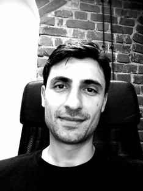

# Grigoriy Piskun

**Software Engineer & Leader**

**phone:** `+79869042101` | **e-mail:** `grigoriy@piskun.su` | **timezone:** `MSK`

# Overview

Hi, comrades! I started my professional journey in the IT industry in 2010. Since then, my passion is to build the modern computer systems collaboratively using the latest technology, pragmatic thinking and adaptive processes.

`Contact me if you want to grow an IT business or if you're in trouble.`

# Achievements

- **[Ятуда](https://yatuda.com)** (May 2022 - now): **Head of Development**
  - invented the product name
  - establised the fundamental processes in the company
  - intoduced the dev stack
  - adopted the best CICD practices
  - architectured the entire plarform
  - build some of the key microservices from the ground up
  - organized the customer support
  - actively participating in the HR activities
  - mentoring and motivating colleagues
  - managing dev & qa teams
  - still writing code and learning new technical things cause I love it!
- **[MessageMedia](https://messagemedia.com)** (Jul 2019 - Jan 2022): **Team Lead / Principal**
  - improved security posture of the organization by implementing the Single Sign-On login flow for customers and internal stuff
  - saved budget by decommissioning an expensive monolithic integration system and replacing it with a set of scalable, easy-maintained serverless components
  - uplifted the infrastructure provisioning practices by introducing the AWS Cloud Development Kit
  - enabled comprehensive monitoring and alerting mechanism as part of the Well-Architected framework implementation
- **[Bachcare](https://www.bachcare.co.nz/)** (Sep 2017 - Jul 2019): **Senior Software Engineer**
  - built a new booking system for the holiday homes in New Zealand
  - optimized GraphQL search queries
- **[Orion Health](https://orionhealth.com)** (Apr 2014 - Sep 2017): **Senior Software Engineer**
  - improved data efficiency of the Patient Portal mobile application by implementing a GraphQL server

From Nov 2010 until Apr 2014, I worked as a back-end software engineer / team lead in areas like spam detection, health care and online banking for the companies like Comodo Group, Team Online A/S and Treasury Intelligence Solutions Gmbh. More details is available upon request.

# Skills

- building IT business from the ground
- team leadership
- crafting efficient processes
- designing architecture
- data processing pipelines
- integration with the 3rd party services
- continues delivery and operations
- testing software at all levels
- organising customer support

# Toolkit

Linux | Java | SOLID | SQL | NoSQL | Clouds | Docker | K8s | Message brokers | REST | Terraform | Rust

# Education & Certification

- Master degree in applied mathematics
- AWS cloud practitioner